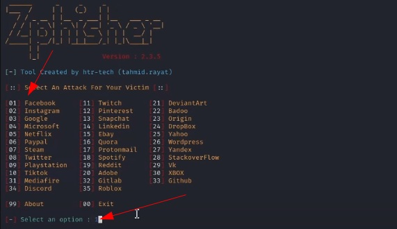
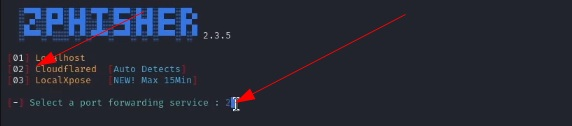
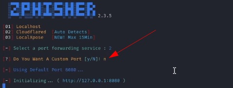
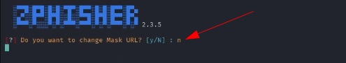
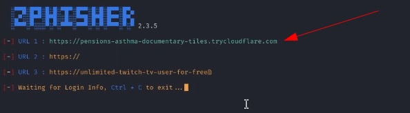

# Phishing para Clonagem do Facebook

## Ferramentas Necessárias
1. **Kali Linux**
2. **ZPhisher**
3. **SET (Social Engineering Toolkit)**

---

## Configurando o Phishing no Kali Linux

### 1. Instalação do ZPhisher
Clonar o repositório abaixo:

```bash
git clone --depth=1 https://github.com/htr-tech/zphisher.git

```

- Na primeira inicialização, o ZPhisher instalará as dependências automaticamente.
- Após o processo, o ZPhisher estará pronto para uso.

---

## ZPhisher clonado, ir ao diretório abaixo:

1. **Diretório do ZPhisher:**
   ```bash
   cd zphisher
   bash zphisher.sh
   ```
 2. `[1]Facebook` para iniciar o site a ser clonado.

 3. `[2]Cloudflaire` para criar o servidor.

 4. `[y/N] n para ficar no porta padrão` para não personalizar a porta.

 5. `[y/N] n para gerar a URL automaticamente` novamente para não mascarar o link.

 6. `[Facebook](http://www.facebook.com)` O link de phishing será gerado e estará pronto para uso.

---

## Bônus: Usando o SET (Social Engineering Toolkit)

### 1. Acessando o SET
Abra um novo terminal e siga os passos:

```bash
# Acesso root
sudo su

# Iniciando o SET
setoolkit
```

### 2. Configuração no SET
1. **Selecione o Tipo de Ataque:**  
   Escolha a opção `Social-Engineering Attacks`.

2. **Escolha o Vetor de Ataque:**  
   Selecione `QRCode Generator Attack Vector`.

3. **Informe a URL gerada do ZPhisher:**  
   Use o endereço do Facebook: [facebook.com](http://www.facebook.com)

**Imagem QRCode gerada com sucesso.**

### 3. Copiando a Imagem
Copiar a imagem gerada para um diretório específico, use o comando abaixo:

```bash
cp /root/.set/reports/qrcode_attack.png /home/kali/picture/
```

---

## Fluxo de Trabalho

Aqui está o resumo visual do fluxo de trabalho:

1. **Escolha a Opção 1** para iniciar o ZPhisher.  
   

2. **Escolha a Opção 2** para criar o servidor.  
   

3. **Porta Padrão:** Digite "n".  
   

4. **Link Padrão:** Digite "n" para não mascarar o link.  
   

5. **Link Gerado com Sucesso.**  
   

6. **Copiando a Imagem:**  
   ```bash
   cp /root/.set/reports/qrcode_attack.png /home/kali/picture/
   ```
   

---

## Observações Finais

- **ZPhisher** é uma ferramenta poderosa para geração de links de phishing.
- **SET** pode ser usado para gerar um QR Code malicioso que redireciona para o link clonado do Facebook.

⚠️ **Aviso Legal:** Este artigo é apenas para fins educacionais. Não utilize essas ferramentas para atividades maliciosas ou ilegais.